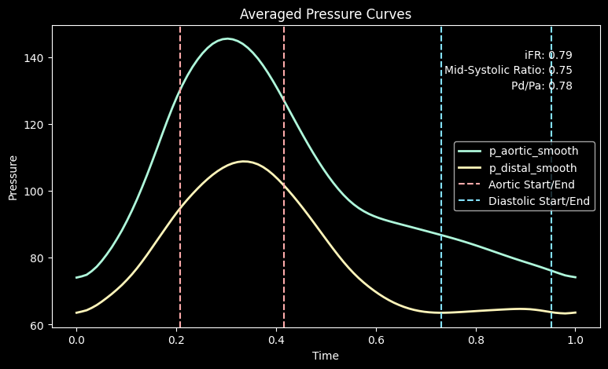
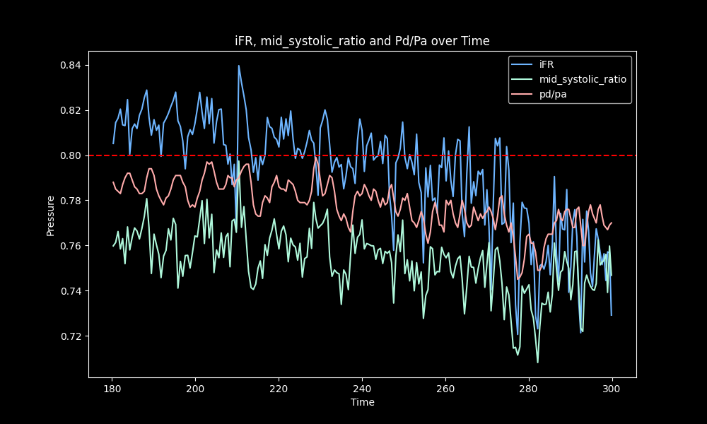

# pressure_curve_processing
## Abstract
This code analyzes invasively measured pressure curves in the context of anomalous aortic origin of a coronary artery (AAOCA). Specifically, it identifies the point of aortic valve closure and then calculates the instantaneous wave-free ratio, mid-systolic pressure ratio, and the integral of the systolic and diastolic phases for the Pa and Pd curves and their differences.<br>
The analysis is automatically performed for all tests conducted (during rest with Pd/Pa, $FFR_\text{Adenosine}$, and $FFR_\text{Dobutamine}$ during the dobutamine-atropine-volume challenge).<br>
Additionally, for pressure measurements over a long period (i.e., $FFR_\text{Adenosine}$ and $FFR_\text{Dobutamine}$), additional analysis for the 25th percentile and 75th percentile of Pd/Pa values is performed.<br>
Lastly, the code produces averaged pressure curves for Pa and Pd for all phases over the recording period and again for the 25th and 75th percentiles.

## Installation

```shell
    python -m venv env
    env\Scripts\activate.bat
    pip install poetry
    poetry install
```

## Expected Input

The analysis expects a dataframe in the following format, derived from invasive Fractional Flow Reserve (FFR) measurements:
```
|    | time | p_aortic | p_mean_aortic | p_distal | p_mean_distal | pd/pa | n/a | peaks |
|----|------|----------|---------------|----------|---------------|-------|-----|-------|
| 0  | 0.01 | 83.0     | 80.7          | 81.4     | 82.0          | 1.016 | 7.1 | 0     |
| 1  | 0.02 | 85.7     | 80.7          | 83.1     | 82.0          | 1.016 | 7.1 | 0     |
| 2  | 0.03 | 88.0     | 80.8          | 85.0     | 82.0          | 1.015 | 7.1 | 0     |
| 3  | 0.04 | 89.6     | 80.8          | 87.3     | 82.0          | 1.015 | 7.1 | 0     |
...
```
Required columns are `time`, `p_aortic`, `p_distal`, `pd/pa` and `peak`

To acquire this data we used RadiView files, on which run a first peak detection with SciPy's `find_peaks` function (Code will be provided in the future).

To run the analysis a folder with the following tree structure is expected:
```
.
├── NARCO_10_eval
│   ├── analysis_narco_10_pressure_.csv
│   ├── narco_10_pressure_ade.csv
│   ├── narco_10_pressure_dobu.csv
│   └── narco_10_pressure_rest_1.csv
├── NARCO_119_eval
│   ├── analysis_narco_119_pressure_.csv
│   ├── narco_119_pressure_ade.csv
│   └── narco_119_pressure_dobu.csv
├── NARCO_122_eval
│   ├── analysis_narco_122_pressure_.csv
│   ├── narco_122_pressure_ade.csv
│   ├── narco_122_pressure_dobu.csv
│   ├── narco_122_pressure_dobu.png
│   ├── narco_122_pressure_rest_1.csv
│   └── narco_122_pressure_rest_1.png
│   
...
```
Note: really required are only files ending with _ade.csv, _dobu.csv, and rest_1.csv. But other files automatically are ignored.

## Output
For every .csv file in subdir a dataframe is created which adds the following columns to existing dataframe: `diastolic_integral_aortic`,  `diastolic_integral_distal`, `diastolic_integral_diff`, `diastolic_ratio`, `iFR`, `systolic_integral_aortic`, `systolic_integral_distal`, `systolic_integral_diff`, `aortic_ratio` and `mid_systolic_ratio`.
Additionally and averaged curve is calculated (for all, 25th percentile and 75th percentile) and the curve data is saved as a .csv and a .png is saved.

A plot for the iFR, mid-systolic ratio and pd/pa over time is also provided for every type of pressure measurement.

The output in the subdir looks the following
```
.
├── NARCO_10_eval
│   ├── narco_10_pressure_ade.csv
│   ├── narco_10_pressure_ade_average_curve_all.csv
│   ├── narco_10_pressure_ade_average_curve_all.png
│   ├── narco_10_pressure_ade_average_curve_high.csv
│   ├── narco_10_pressure_ade_average_curve_high.png
│   ├── narco_10_pressure_ade_average_curve_low.csv
│   ├── narco_10_pressure_ade_average_curve_low.png
│   ├── narco_10_pressure_ade_pdpa_iFR_midsystolic_over_time.png
│   ├── narco_10_pressure_dobu.csv
│   ├── narco_10_pressure_dobu_average_curve_all.csv
│   ├── narco_10_pressure_dobu_average_curve_all.png
│   ├── narco_10_pressure_dobu_average_curve_high.csv
│   ├── narco_10_pressure_dobu_average_curve_high.png
│   ├── narco_10_pressure_dobu_average_curve_low.csv
│   ├── narco_10_pressure_dobu_average_curve_low.png
│   ├── narco_10_pressure_dobu_pdpa_iFR_midsystolic_over_time.png
│   ├── narco_10_pressure_rest_1.csv
│   ├── narco_10_pressure_rest_1_average_curve_all.csv
│   ├── narco_10_pressure_rest_1_average_curve_all.png
│   ├── narco_10_pressure_rest_1_average_curve_high.csv
│   ├── narco_10_pressure_rest_1_average_curve_high.png
│   ├── narco_10_pressure_rest_1_average_curve_low.csv
│   ├── narco_10_pressure_rest_1_average_curve_low.png
│   └── narco_10_pressure_rest_1_pdpa_iFR_midsystolic_over_time.png
├── NARCO_119_eval
│   ├── narco_119_pressure_ade.csv
│   ├── narco_119_pressure_ade_average_curve_all.csv
...
```
A database is further created with mean values, which are saved under the path specified in the config.yaml as ouput_dir_ivus
```yaml
defaults:
  - _self_
  - override hydra/hydra_logging: disabled
  - override hydra/job_logging: disabled

hydra:
  output_subdir: null
  run:
    dir: .

main:
  input_dir: "C:/WorkingData/Documents/2_Coding/Python/pressure_curve_processing/test"
  output_dir_data: "C:/WorkingData/Documents/2_Coding/Python/pressure_curve_processing/test/processed"
  output_dir_ivus: "C:/WorkingData/Documents/2_Coding/Python/pressure_curve_processing/output/ivus"
```
